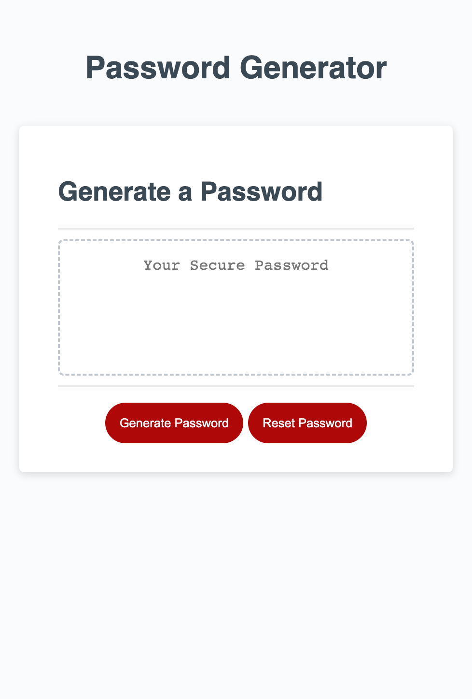

# JavaScript-Challenge-Password-Generator
HW Challenge #3

## Project Description

This homework assginment taught us how to generate a password that meets a certain criteria to increase security for sensitive data that the user has. We had to make sure that the password only contains the characters that the user selects "OK" to. When the user clicks "Cancel" that means they do not want to that/those specific character(s) to be part of the generated password. I wanted to challenge myself and added both a "reset button" and "copy to clipboard button". I did this so the user can easily reset their password if they made a mistake instead of clicking on the refresh button. Secondly, they can use the refresh button to easily and quickly have as many passwords generated for them. In addtion, I added the copy to clipboard button, so the user can easily copy their password to their clipboard. Instead of having to use the right click button on the mouse or use the keyboard.This helped me to impove on my javascript skills. I struggled on this since Javascript so far has been the most challenging topic we have worked on so far. My live page can be seen in the <a href="#Table of Contents">Table of Contents</a> section.The HTML and CSS codes and part of the Javascript codes were all already provided by UCSD Coding Bootcamp. They had already added a media query to make it user friendly for those who choose to use the <a href=https://hannybear88.github.io/JavaScript-Challenge-Password-Generator/>deployed application</a> on either a mobile and/or tablet. You can <a href=https://github.com/hannybear88/JavaScript-Challenge-Password-Generator/>Click here</a> to see my code for this project. 

## Table of Contents
<nav>
    <ol>
        <li><a href="#How to Use this Project">How to Use this Project</a></li>
        <li><a href="#Support">Support</a></li>
        <li><a href="#Credits">Credits</a></li>
        <li><a href="#Contributors">Contributors</a></li>
    </ol>
</nav>

## Installation

Installation is not required, unless you plan on refactoring the code. Please <a href="mailto:hannahkchung88@gmail.com">email me</a> to make sure this is okay. 

## How to Use the Project

<a href=https://hannybear88.github.io/JavaScript-Challenge-Password-Generator/>Click here</a> to be directed straight to the deployed application

 

## Support
If you need extra support feel free to <a href="mailto:hannahkchung88@gmail.com">email me</a>

## Credits
<ul>
    <li>Code refactored by Hannah Chung</li>
    <li>index.html, style.css, and script.js starter codes provided by UCSD Coding Bootcamp</li>
</ul>

## Contributors
<ul>
    <li>Code refactored by Hannah Chung</li>
    <li>index.html, style.css, and script.js starter codes provided by UCSD Coding Bootcamp</li>
</ul>